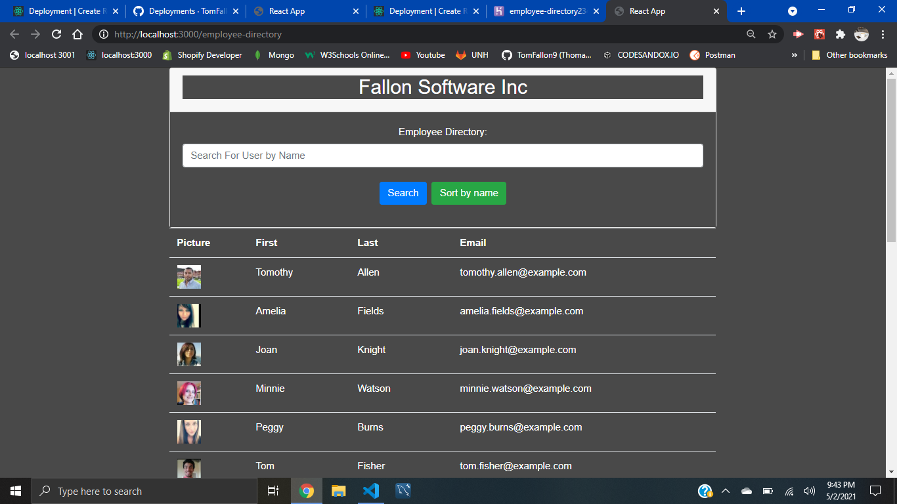

# Employee Directory

Built with React

URL of the GitHub repository: https://github.com/TomFallon9/employee-directory

URL to the deployed application: https://employee-directory2345.herokuapp.com/

## Table of Contents 

* [Description](#description)
* [View](#view)
* [Built With](#built-with)
* [Credits](#credits)
* [License](#license)

## Description

This React application contains an employee directory that is currently loaded with data from this [random user generator](https://randomuser.me/). This application would be useful for anyone who needs quick access to employee data. An employee or manager would benefit greatly from being able to view non-sensitive and filter through data about other employees. 

## View

## Built With

* [React.js](https://reactjs.org/) - A JavaScript Library used for building user interfaces. 

## Credits

The random users were generated using the [Random User Generator API](https://randomuser.me/).

## License

Copyright 2021 Thomas Fallon 🚀

